<!-- Este template foi criado para servir como referência e pode ser facilmente adaptado para diferentes projetos de desenvolvimento -->

<a href="https://classroom.github.com/online_ide?assignment_repo_id=99999999&assignment_repo_type=AssignmentRepo"></a> <a href="https://classroom.github.com/open-in-codespaces?assignment_repo_id=99999999"></a>

---

# ♟️ ChessMate 👨‍💻

> [!NOTE]
> Plataforma de xadrez online com matchmaking por rating Elo, análise de partidas com Stockfish e ranking competitivo. **Jogue, aprenda e evolua no tabuleiro.**

<table>
  <tr>
    <td width="800px">
      <div align="justify">
        O <b>ChessMate</b> é uma plataforma de xadrez online inspirada no <a href="https://www.chess.com">Chess.com</a>, desenvolvida como projeto acadêmico da disciplina <i>Projeto de Software</i> da <b>PUC Minas</b>, sob orientação do <a href="https://github.com/joaopauloaramuni">Prof. Dr. João Paulo Aramuni</a>. O sistema oferece partidas em tempo real via <b>WebSocket</b>, matchmaking automático por <b>rating Elo</b>, análise de partidas com o motor <b>Stockfish</b> e um ranking competitivo com histórico completo de evolução. A arquitetura segue o modelo <b>cliente-servidor</b> com back-end em <b>Spring Boot 3</b>, front-end em <b>React 19</b>, banco de dados <b>PostgreSQL 15</b>, cache com <b>Redis 7</b> e infraestrutura na <b>AWS</b>. O objetivo é demonstrar, na prática, os conceitos de <i>engenharia de software</i>, <i>design de APIs REST</i>, <i>comunicação em tempo real</i>, <i>modelagem UML</i> e <i>boas práticas de desenvolvimento</i>.
      </div>
    </td>
    <td>
      <div>
        
      </div>
    </td>
  </tr>
</table>

---

## 🚧 Status do Projeto

### Exemplos de badges básicos:

[](https://github.com/vitorazevedop7/ChessMate/actions)
[](https://codecov.io/gh/vitorazevedop7/ChessMate)
[](https://github.com/vitorazevedop7/ChessMate/releases)
[](#licença)

### Outros exemplos de badges:

[](https://github.com/vitorazevedop7/ChessMate/releases)                

---

## 📚 Índice
- [Links Úteis](#-links-úteis)
- [Sobre o Projeto](#-sobre-o-projeto)
- [Funcionalidades Principais](#-funcionalidades-principais)
- [Tecnologias Utilizadas](#-tecnologias-utilizadas)
- [Arquitetura](#-arquitetura)
  - [Exemplos de diagramas](#exemplos-de-diagramas)
- [Instalação e Execução](#-instalação-e-execução)
  - [Pré-requisitos](#pré-requisitos)
  - [Variáveis de Ambiente](#-variáveis-de-ambiente)
     - [1 Back-end (Spring Boot)](#1-back-end-spring-boot)
     - [2 Front-end (React, Vite)](#2-front-end-react-vite)
     - [3 Exemplos de Variáveis de Ambiente na Vercel](#3-exemplos-de-variáveis-de-ambiente-na-vercel)
  - [Instalação de Dependências](#-instalação-de-dependências)
    - [Front-end (React)](#front-end-react)
    - [Back-end (Spring Boot)](#back-end-spring-boot)
  - [Inicialização do Banco de Dados (PostgreSQL)](#-inicialização-do-banco-de-dados-postgresql)
  - [Como Executar a Aplicação](#-como-executar-a-aplicação)
    - [Terminal 1: Back-end (Spring Boot)](#terminal-1-back-end-spring-boot)
    - [Terminal 2: Front-end (React, Vite)](#terminal-2-front-end-react-vite)
    - [Execução Local Completa com Docker Compose (Incluindo Banco de Dados)](#-execução-local-completa-com-docker-compose-incluindo-banco-de-dados)
    - [Passos para build, inicialização e execução](#-passos-para-build-inicialização-e-execução)
- [Deploy](#-deploy)
- [Estrutura de Pastas](#-estrutura-de-pastas)
- [Demonstração](#-demonstração)
  - [Diagramas UML](#-diagramas-uml)
  - [Aplicação Web](#-aplicação-web)
  - [Exemplo de saída no Terminal (para Back-end, API, CLI)](#-exemplo-de-saída-no-terminal-para-back-end-api-cli)
- [Testes](#-testes)
- [Documentações utilizadas](#-documentações-utilizadas)
- [Autores](#-autores)
- [Contribuição](#-contribuição)
- [Agradecimentos](#-agradecimentos)
- [Licença](#-licença)

---

## 🔗 Links Úteis
* 🌐 **Demo Online:** [Acesse o ChessMate](https://chessmate.vercel.app)
  > 💻 **Descrição:** Instância de demonstração do front-end hospedada na Vercel com back-end no AWS ECS (Fargate).
* 📖 **Documentação da API:** [Swagger UI](https://api.chessmate.vercel.app/swagger-ui.html)
  > 📚 **Descrição:** Documentação interativa dos endpoints REST gerada pelo SpringDoc OpenAPI 2.x.
* 📐 **Diagramas PlantUML:** [diagramas/diagramas.md](./diagramas/diagramas.md)
  > 🗂️ **Descrição:** Todos os diagramas UML do projeto (casos de uso, classes, sequência, estados, ER, DSS, comunicação e arquitetura).

---

## 📝 Sobre o Projeto

O **ChessMate** nasceu da necessidade de explorar, em contexto acadêmico, a construção de um sistema web complexo com comunicação bidirecional em tempo real, cobrindo o ciclo completo de engenharia de software — da elicitação de requisitos à modelagem arquitetural.

**Por que ele existe:** a disciplina *Projeto de Software* da PUC Minas exige a aplicação prática de padrões de projeto, modelagem UML detalhada e boas práticas de engenharia de software em um sistema com escopo realista e documentação profissional.

**Qual problema resolve:** facilita o acesso ao xadrez online com uma plataforma com foco em aprendizado — o jogador recebe feedback imediato sobre a qualidade de cada jogada graças à integração com o motor Stockfish, podendo acompanhar sua evolução pelo histórico de rating Elo.

**Contexto:** projeto acadêmico individual, PUC Minas, 2026/1, disciplina *Projeto de Software*, sob orientação do Prof. Dr. João Paulo Aramuni.

**Onde pode ser utilizado:** clubes de xadrez, escolas, plataformas educacionais e comunidades que queiram uma solução open-source de xadrez online com análise integrada.

> [!NOTE]
> Este repositório concentra a **documentação técnica e os diagramas UML** do ChessMate. O código-fonte da aplicação está organizado em módulos separados (back-end Spring Boot e front-end React) conforme descrito na seção de estrutura de pastas.

---

## ✨ Funcionalidades Principais

- 🔐 **Autenticação Segura:** cadastro, login com JWT e recuperação de senha por e-mail (SendGrid).
- ♟️ **Matchmaking por Elo:** pareamento automático por rating e modalidade (Clássico, Rápido, Blitz, Bullet).
- ⚡ **Partidas em Tempo Real:** movimentação de peças e eventos via WebSocket (STOMP/SockJS) com validação server-side.
- 🤖 **Análise com Stockfish:** avaliação lance a lance com classificação (Excelente, Bom, Imprecisão, Erro, Erro Crítico) e sugestão de melhor jogada.
- 📊 **Ranking Competitivo:** tabela de classificação com histórico de evolução do Elo por modalidade.
- 👥 **Sistema Social:** amigos, solicitações de amizade, convites para partida e perfis públicos.
- 📁 **Exportação PGN:** download da notação completa da partida em formato PGN padrão.
- 🛡️ **Painel Administrativo:** gerenciamento de usuários, suspensão de contas, auditoria e relatórios com registro de cada ação do admin.

---

## 🛠 Tecnologias Utilizadas

As seguintes ferramentas, frameworks e bibliotecas foram utilizados na construção deste projeto. Recomenda-se o uso das versões listadas (ou superiores) para garantir a compatibilidade.

### 💻 Front-end

* **Biblioteca:** React 19.1.0
* **Linguagem:** TypeScript 5.x
* **Estilização:** Tailwind CSS 3.x + shadcn/ui
* **Gerenciamento de Estado:** Zustand 4.x
* **Build Tool:** Vite 6.3.5
* **Comunicação em Tempo Real:** SockJS-client + STOMP.js
* **Tabuleiro de Xadrez:** react-chessboard + chess.js

### 🖥️ Back-end

* **Linguagem/Runtime:** Java 17 (JDK)
* **Framework:** Spring Boot 3.3.5
* **WebSocket:** Spring WebSocket + STOMP
* **Banco de Dados:** PostgreSQL 15
* **Cache:** Redis 7 (AWS ElastiCache)
* **ORM / Query Builder:** Hibernate / Spring Data JPA
* **Autenticação:** JWT (JJWT 0.12) + Spring Security 6
* **Migração de Schema:** Flyway 10.x
* **Documentação da API:** SpringDoc OpenAPI 2.x (Swagger UI)
* **Processamento Assíncrono:** Spring Batch + AWS SQS

### ⚙️ Infraestrutura & DevOps

* **Containerização:** Docker + Docker Compose
* **Orquestração:** AWS ECS (Fargate) com Auto Scaling
* **Cloud:** AWS (ECS, RDS, ElastiCache, S3, SQS, API Gateway, CloudFront)
* **CI/CD:** GitHub Actions
* **Front-end Hosting:** Vercel
* **E-mail Transacional:** SendGrid + AWS SES

---

## 🏗 Arquitetura

O ChessMate adota uma **arquitetura em camadas** (Layered Architecture) no back-end, seguindo o padrão **MVC** com separação clara entre **Controller**, **Service**, **Repository** e **Model**. O front-end é uma **SPA (Single Page Application)** em React que se comunica com o back-end via **REST API** (operações CRUD) e **WebSocket/STOMP** (eventos de partida em tempo real). O processamento pesado de análise com Stockfish é desacoplado via **filas assíncronas** (AWS SQS + Spring Batch).

**Principais componentes:**
- **API Gateway (AWS):** roteamento, autenticação JWT, rate limiting e CORS
- **Back-end Spring Boot:** 8 serviços por domínio (Auth, Partida, Matchmaking, Análise, Social, Admin, Ranking, Relatório)
- **WebSocket Server:** movimentos e notificações em tempo real via STOMP/SockJS
- **Worker de Análise:** Spring Batch consome filas SQS e aciona o motor Stockfish
- **PostgreSQL (AWS RDS Multi-AZ):** persistência principal com read replica para relatórios
- **Redis (AWS ElastiCache):** sessões JWT, rankings e fila de matchmaking

**Padrões de design adotados:** Repository Pattern, Service Layer, DTO (Data Transfer Object), Strategy (validação de movimentos por tipo de peça), Observer (eventos de partida via WebSocket), Factory (criação de partidas), Template Method (análise de lances).

### Exemplos de diagramas

Para melhor visualização e entendimento da estrutura do sistema, os diagramas principais estão organizados lado a lado. Todos os arquivos fonte (`.puml`) e imagens (`.png`) estão em [`diagramas/`](./diagramas/).

| Diagrama de Arquitetura | Detalhe da Arquitetura |
| :---: | :---: |
| **Visão Geral — C4 Container** | **Componentes e Implantação** |
| 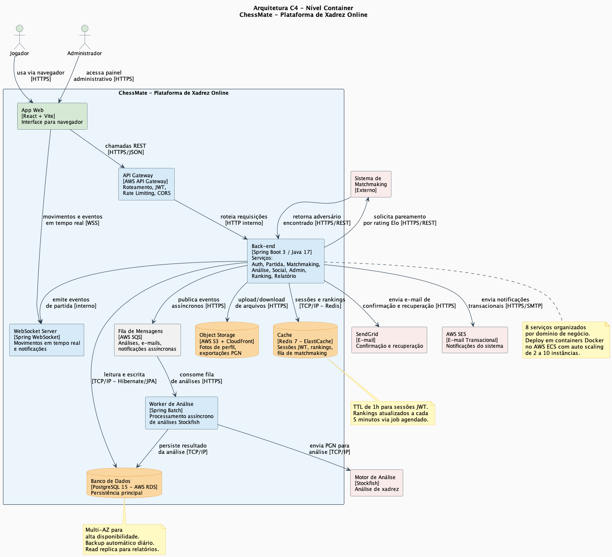 | 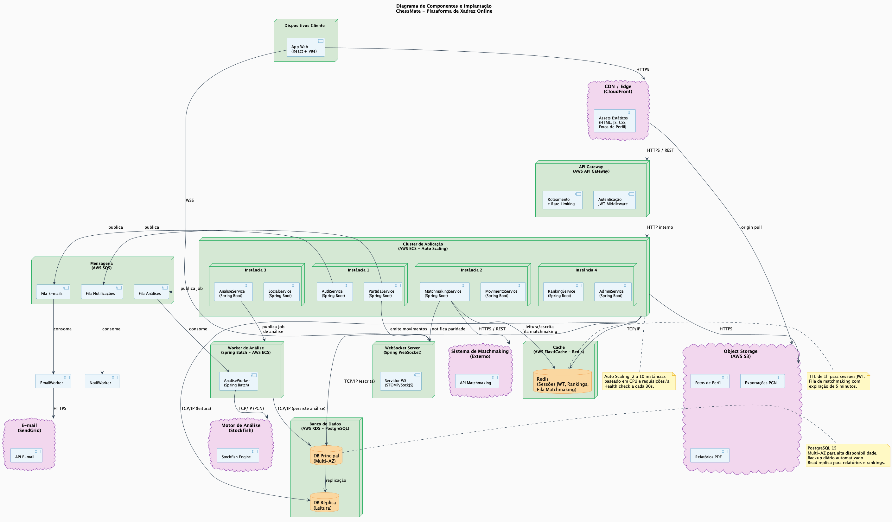 |
| **Diagrama de Classes** | **Modelo de Dados (ER)** |
| 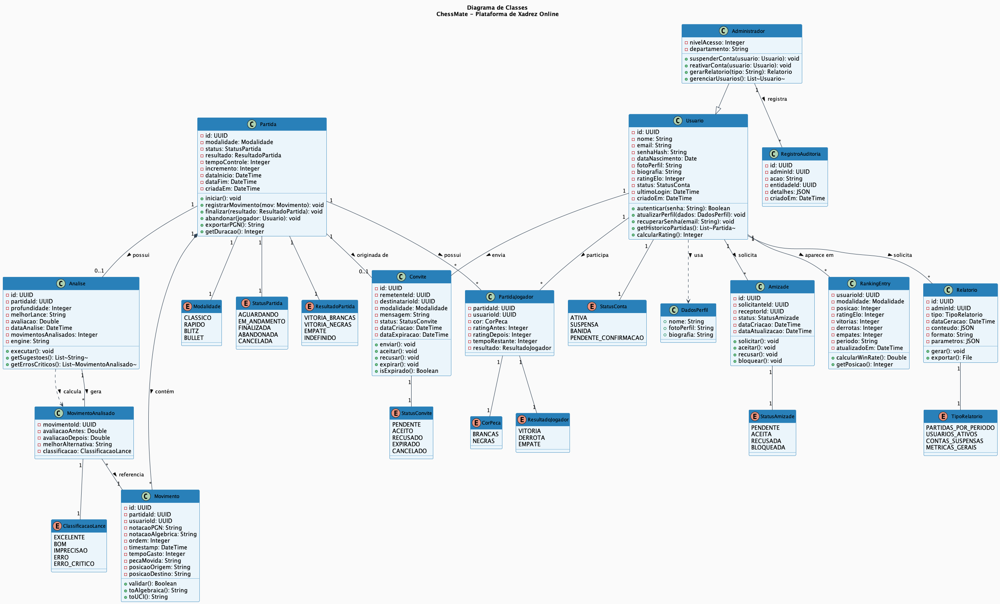 | 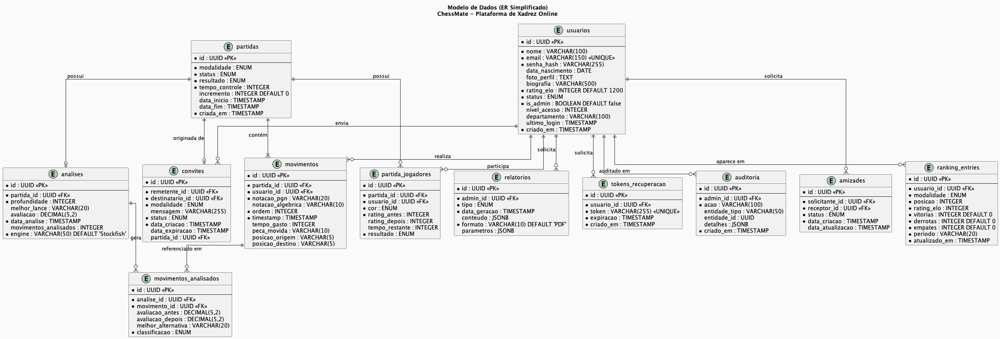 |
| **Casos de Uso** | **Sequência — Buscar Partida** |
| 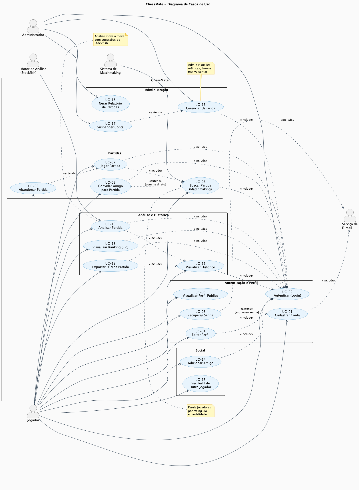 | 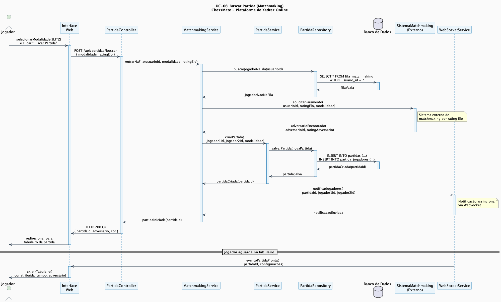 |

---

## 🔧 Instalação e Execução

### Pré-requisitos
Certifique-se de que o ambiente esteja configurado com os itens abaixo.

* **Java JDK:** Versão **17** ou superior (necessário para o Back-end Spring Boot)
* **Node.js:** Versão LTS (v18.x ou superior) (necessário para o Front-end React)
* **Gerenciador de Pacotes:** npm ou yarn
* **Docker** (Opcional, mas **altamente recomendado** para rodar o Banco de Dados e o Redis)

---

### 🔑 Variáveis de Ambiente

Crie arquivos `.env` específicos e/ou configure as variáveis de ambiente no seu sistema para cada parte da aplicação.

#### 1 Back-end (Spring Boot)

Configure estas variáveis como **variáveis de ambiente do sistema** ou em `backend/src/main/resources/application.yml`.

| Variável | Descrição | Exemplo |
| :--- | :--- | :--- |
| `SERVER_PORT` | Porta onde o Back-end será executado. | `8080` |
| `SPRING_DATASOURCE_URL` | URL de conexão JDBC (PostgreSQL). | `jdbc:postgresql://localhost:5432/chessmate` |
| `SPRING_DATASOURCE_USERNAME` | Usuário do banco de dados. | `postgres` |
| `SPRING_DATASOURCE_PASSWORD` | Senha do banco de dados. | `senha-segura-123` |
| `JWT_SECRET` | Chave secreta para assinatura de tokens JWT. | `chave_super_segura_base64` |
| `JWT_EXPIRATION_MS` | Tempo de expiração do token em milissegundos. | `86400000` |
| `REDIS_HOST` | Host do servidor Redis. | `localhost` |
| `REDIS_PORT` | Porta do servidor Redis. | `6379` |
| `SENDGRID_API_KEY` | Chave da API SendGrid para e-mails. | `SG.sua_sendgrid_key_aqui` |
| `AWS_SQS_QUEUE_URL` | URL da fila SQS para jobs de análise. | `https://sqs.us-east-1.amazonaws.com/...` |

#### 2 Front-end (React, Vite)

Crie um arquivo **`.env.local`** na raiz da pasta `/frontend` com o prefixo `VITE_`.

| Variável | Descrição | Exemplo |
| :--- | :--- | :--- |
| `VITE_API_URL` | URL base da API REST do back-end. | `http://localhost:8080/api` |
| `VITE_WS_URL` | URL do endpoint WebSocket. | `http://localhost:8080/ws` |

---

#### 3. Exemplos de Variáveis de Ambiente na Vercel

A Vercel permite configurar variáveis no painel (Project Settings > Environment Variables).
Aqui estão exemplos utilizados no front-end React/Vite do ChessMate:

---

##### **Exemplo 1 – Front-end React (Vite) apontando para o back-end AWS**

```
VITE_API_URL=https://api.chessmate.vercel.app/api
VITE_WS_URL=https://api.chessmate.vercel.app/ws
```

---

##### **Exemplo 2 – Variáveis de serviços externos**

```
SENDGRID_API_KEY=SG.sua_sendgrid_key_aqui
AWS_SES_REGION=us-east-1
```

---

##### **Exemplo 3 – Configuração completa de produção (Back-end no AWS ECS)**

```
SPRING_DATASOURCE_URL=jdbc:postgresql://chessmate.cluster.us-east-1.rds.amazonaws.com:5432/chessmate
SPRING_DATASOURCE_USERNAME=chessmate_user
SPRING_DATASOURCE_PASSWORD=senha-producao-segura
JWT_SECRET=chave_jwt_producao_super_segura_base64
REDIS_HOST=chessmate.cache.amazonaws.com
REDIS_PORT=6379
```

---

##### **Exemplo 4 – Frontend com Vite (configuração local completa)**

```
VITE_API_URL=http://localhost:8080/api
VITE_WS_URL=http://localhost:8080/ws
```

> **Obs:** As variáveis de ambiente em projetos **Vite** precisam começar com `VITE_` para que o Vite as reconheça e as inclua no *bundle* do frontend; variáveis sem esse prefixo não ficam disponíveis no código do cliente.

---

Para adicionar essas variáveis:

1. Acesse a página de Environment Variables do seu projeto na Vercel (ex.: `https://vercel.com/<seu-usuario>/chessmate/settings/environment-variables`)
2. Clique em **"Add"** para adicionar cada variável com o nome e valor correspondente.

Alternativamente, se estiver desenvolvendo localmente, crie um arquivo **`.env.local`** dentro da pasta **`frontend`** do seu projeto com o seguinte conteúdo:

```
# Variável essencial para conectar ao Back-end Spring Boot rodando localmente
VITE_API_URL=http://localhost:8080/api

# Endpoint WebSocket para partidas em tempo real
VITE_WS_URL=http://localhost:8080/ws
```

> 💡 **Localização:** Garanta que este arquivo esteja em **`/frontend/.env.local`** para que o **Vite** consiga carregá-lo e disponibilizar as variáveis para o Front-end durante o desenvolvimento.

### 📦 Instalação de Dependências

Clone o repositório e instale as dependências.

1. **Clone o Repositório:**

```bash
git clone https://github.com/vitorazevedop7/ChessMate.git
cd ChessMate
```

2. **Instale as Dependências (Monorepo):**

Como o projeto está dividido, você precisa instalar as dependências separadamente para o Front-end (React, usando npm) e garantir que o Back-end (Spring Boot, usando Maven Wrapper) tenha suas dependências resolvidas.

#### Front-end (React)

Acesse a pasta do Front-end e instale as dependências do Node.js:

```bash
cd frontend
npm install
cd ..
```

#### Back-end (Spring Boot)

O Spring Boot utiliza o **Maven Wrapper** (`./mvnw`) para gerenciar dependências:

```bash
cd backend
./mvnw clean install
cd ..
```

---

### 💾 Inicialização do Banco de Dados (PostgreSQL)

O projeto utiliza **PostgreSQL 15**. A forma mais fácil de inicializar o banco é via Docker:

1. **Rode o Container do PostgreSQL:**

```bash
docker run --name chessmate_db \
  -e POSTGRES_USER=postgres \
  -e POSTGRES_PASSWORD=senha-segura-123 \
  -e POSTGRES_DB=chessmate \
  -p 5432:5432 \
  -d postgres:15
```

2. **Rode o Container do Redis:**

```bash
docker run --name chessmate_redis \
  -p 6379:6379 \
  -d redis:7
```

3. **Execute as Migrações:**
   O Back-end **Spring Boot** gerencia o schema automaticamente via **Flyway** na inicialização. Para rodar manualmente:

```bash
cd backend
./mvnw flyway:migrate
```

---

### ⚡ Como Executar a Aplicação

Execute a aplicação em modo de desenvolvimento em **dois terminais separados**.

#### Terminal 1: Back-end (Spring Boot)

Inicie a API do Spring Boot. Ela tentará se conectar ao PostgreSQL e ao Redis rodando no Docker.

```bash
cd backend
./mvnw spring-boot:run
```
🚀 *O Back-end estará disponível em **http://localhost:8080**. Swagger UI em **http://localhost:8080/swagger-ui.html**.*

---

#### Terminal 2: Front-end (React, Vite)

Inicie o servidor de desenvolvimento do Front-end.

```bash
cd frontend
npm run dev
```
🎨 *O Front-end estará disponível em **http://localhost:5173**.*

---

#### 🐳 Execução Local Completa com Docker Compose (Incluindo Banco de Dados)

Para uma execução local que inclui o serviço de Back-end (**Spring Boot**), Front-end (**React**), banco de dados **PostgreSQL** e cache **Redis**, usaremos o **`docker-compose`** para orquestração.

Antes de tudo, certifique-se de que o **Docker Desktop** (no Mac/Windows) ou o **serviço Docker** (em Linux) está em execução.

- **No Mac/Windows**: basta abrir o aplicativo **Docker Desktop**.
- **No Linux**: rode o comando abaixo para iniciar o serviço:

```bash
sudo systemctl start docker
```

---

#### 📦 Passos para build, inicialização e execução

1. Acesse a pasta raiz do projeto (onde o arquivo `docker-compose.yml` está localizado):

```bash
cd /caminho/do/projeto/ChessMate
```

2. Suba todos os serviços (Back-end, Front-end, PostgreSQL e Redis) definidos no `docker-compose.yml`:

```bash
docker-compose up --build -d
```

> [!NOTE]
> 💡 O parâmetro `--build` garante que as imagens mais recentes do projeto sejam geradas, e `-d` executa em segundo plano.

3. Verifique se os containers estão rodando:

```bash
docker ps
```

4. **Acompanhe as migrações do banco de dados via logs:**

```bash
docker logs chessmate-backend
```

5. Abra no navegador:
   O Front-end estará acessível em **http://localhost:3000** e o Back-end em **http://localhost:8080**.

6. Para parar e remover todos os containers:

```bash
docker-compose down
```

✅ **Em resumo:** Usar **`docker-compose`** simplifica a execução do ambiente completo, isolando as dependências de **Java (Spring Boot)** e **Node.js (React)** e garantindo que o PostgreSQL e o Redis estejam disponíveis.

---

## 🚀 Deploy

Instruções para deploy em produção no ambiente AWS + Vercel.

1. **Build do Projeto:**

```bash
# 1. Build do Front-end (React/Vite) — gera a pasta /frontend/dist com arquivos estáticos
cd frontend
npm run build

# 2. Build do Back-end (Spring Boot/Maven) — gera o arquivo .jar em /backend/target
cd ../backend
./mvnw clean package -DskipTests
```

2. **Configuração do Ambiente de Produção:**

| Serviço | Provedor | Observação |
| :--- | :--- | :--- |
| Front-end | **Vercel** | Deploy automático via push no branch `main` |
| Back-end | **AWS ECS (Fargate)** | Auto Scaling de 2 a 10 instâncias por CPU |
| Banco de Dados | **AWS RDS PostgreSQL 15 Multi-AZ** | Backup diário + read replica para relatórios |
| Cache | **AWS ElastiCache Redis 7** | TTL de 1h para sessões JWT |
| Assets / PGN | **AWS S3 + CloudFront** | CDN global para baixa latência |
| E-mail | **SendGrid + AWS SES** | Confirmação de conta e notificações |

> 🔑 **Variáveis cruciais:** configure `SPRING_DATASOURCE_URL` (endpoint RDS), `SPRING_DATASOURCE_PASSWORD`, `JWT_SECRET`, `REDIS_HOST` e `VITE_API_URL` no painel do ECS e da Vercel antes do primeiro deploy.

3. **Execução em Produção:**

```bash
# ☕ Back-end Spring Boot (JAR)
java -jar backend/target/chessmate-1.0.0-SNAPSHOT.jar

# 🌐 Front-end
# Os arquivos estáticos de /frontend/dist são publicados automaticamente pela Vercel.
# Para simular localmente:
npm install -g serve
serve -s frontend/dist
```

---

## 📂 Estrutura de Pastas

> [!NOTE]
> A árvore abaixo combina a **estrutura real versionada neste repositório** (documentação e diagramas UML) com a **estrutura-alvo fictícia/planejada** descrita neste README para a aplicação completa (front-end React, back-end Spring Boot, Docker, CI/CD e testes).

```
ChessMate/
├── .editorconfig                     # ✍️ Padronização de estilo de código (planejado).
├── .env.local                        # 🔒 Variáveis sensíveis locais (não versionado; exemplo fictício).
├── .env.test                         # 🧪 Variáveis para testes automatizados (planejado).
├── .env.staging                      # ☁️ Variáveis para homologação/staging (planejado).
├── .env.example                      # 🧩 Exemplo de variáveis necessárias, sem dados sensíveis (planejado).
├── .gitignore                        # 🧹 Ignora arquivos não versionados.
├── .vscode/                          # ⚙️ Configurações opcionais da IDE (planejado).
│   ├── extensions.json               # 🧩 Extensões recomendadas.
│   └── settings.json                 # 🔧 Preferências locais do workspace.
├── .github/                          # 🤖 CI/CD, issues e pull requests (planejado).
│   ├── workflows/
│   │   ├── ci.yml                    # ✅ Pipeline de build, lint e testes.
│   │   └── deploy.yml                # 🚀 Pipeline de deploy em staging/produção.
│   ├── ISSUE_TEMPLATE/
│   └── pull_request_template.md
├── README.md                         # 📘 Documentação principal do projeto.
├── CONTRIBUTING.md                   # 🤝 Guia de contribuição (planejado).
├── LICENSE                           # ⚖️ Licença MIT.
├── Documentacao_de_Projeto_ChessMate.docx  # 📄 Documento acadêmico completo.
├── docker-compose.yml                # 🐳 Orquestração local de front/back/db/cache (planejado).
├── docker-compose.override.yml       # 🐳 Sobrescritas para desenvolvimento local (planejado).
│
├── frontend/                         # 🌐 Aplicação React 19 + Vite + TypeScript (planejado).
│   ├── .env.example                  # 🧩 Variáveis VITE_API_URL e VITE_WS_URL.
│   ├── Dockerfile                    # 🐳 Build do front-end.
│   ├── .eslintrc.js                  # ✨ Regras do ESLint.
│   ├── .prettierrc                   # 🎨 Configuração do Prettier.
│   ├── index.html                    # 🧭 Entrada HTML do Vite.
│   ├── public/                       # 📂 Arquivos estáticos.
│   │   ├── favicon.svg               # ♟️ Ícone da aplicação.
│   │   └── robots.txt
│   ├── src/                          # 📂 Código-fonte React.
│   │   ├── assets/                   # 🖼️ Recursos estáticos importados.
│   │   │   ├── fonts/                # ✒️ Fontes personalizadas.
│   │   │   ├── icons/                # 💡 Ícones.
│   │   │   └── images/               # 🖼️ Imagens.
│   │   ├── components/               # 🧱 Componentes reutilizáveis de UI.
│   │   │   ├── board/                # ♟️ Tabuleiro e peças.
│   │   │   ├── layout/               # 🧭 Header, sidebar e shell da aplicação.
│   │   │   └── ui/                   # 🎛️ Botões, cards, dialogs e inputs.
│   │   ├── hooks/                    # 🎣 Hooks personalizados.
│   │   ├── pages/                    # 📄 Páginas e rotas.
│   │   │   ├── Auth/                 # 🔐 Login, cadastro e recuperação de senha.
│   │   │   ├── Game/                 # ⚡ Sala de partida em tempo real.
│   │   │   ├── Ranking/              # 📊 Ranking Elo.
│   │   │   └── Profile/              # 👤 Perfil e histórico.
│   │   ├── services/                 # 🔌 Clientes REST e WebSocket/STOMP.
│   │   ├── stores/                   # 🧠 Estado global com Zustand.
│   │   ├── styles/                   # 🎨 Tailwind, tema e estilos globais.
│   │   ├── types/                    # 🧾 Tipos TypeScript.
│   │   └── utils/                    # 🛠️ Funções utilitárias.
│   ├── package.json                  # 📦 Dependências e scripts.
│   └── package-lock.json             # 🔒 Lockfile das dependências.
│
├── backend/                          # ☕ Aplicação Spring Boot 3 + Java 17 (planejado).
│   ├── .env.example                  # 🧩 Variáveis do back-end.
│   ├── Dockerfile                    # 🐳 Build do back-end.
│   ├── pom.xml                       # 🛠️ Build Maven e dependências.
│   ├── src/main/java/                # 📂 Código-fonte Java.
│   │   └── br/pucminas/chessmate/
│   │       ├── ChessMateApplication.java  # 🚀 Classe principal Spring Boot.
│   │       ├── config/               # 🔧 CORS, Swagger, Redis, SQS e WebSocket.
│   │       ├── controller/           # 🎮 Endpoints REST.
│   │       ├── service/              # ⚙️ Regras de negócio.
│   │       ├── repository/           # 🗄️ Repositórios JPA/Hibernate.
│   │       ├── model/                # 🧬 Entidades persistentes.
│   │       ├── domain/               # 🌐 Objetos e regras de domínio.
│   │       ├── dto/                  # ✉️ Data Transfer Objects.
│   │       ├── security/             # 🛡️ JWT e Spring Security.
│   │       ├── websocket/            # 📡 STOMP/SockJS para partidas.
│   │       ├── integration/          # 🔗 SendGrid, Stockfish, SQS e serviços externos.
│   │       ├── batch/                # 🤖 Jobs assíncronos de análise Stockfish.
│   │       └── exception/            # 💥 Exceptions e handlers globais.
│   ├── src/main/resources/           # 📂 Recursos do Spring Boot.
│   │   ├── application.yml           # ⚙️ Configuração principal.
│   │   ├── application-dev.yml       # 🧪 Ambiente de desenvolvimento.
│   │   ├── application-prod.yml      # 🚀 Ambiente de produção.
│   │   ├── application-test.yml      # 🧪 Ambiente de testes.
│   │   ├── static/                   # 🌐 Arquivos estáticos opcionais.
│   │   ├── templates/                # 🖼️ Templates de e-mail.
│   │   ├── messages/                 # 🌎 Internacionalização.
│   │   └── db/migration/             # 📜 Migrações Flyway.
│   └── src/test/java/                # 🧪 Testes unitários e de integração.
│
├── scripts/                          # 📜 Scripts de automação (planejado).
│   ├── dev.sh                        # 🚀 Sobe ambiente completo de desenvolvimento.
│   ├── build_all.sh                  # 🛠️ Build geral de front-end e back-end.
│   ├── generate_diagrams.sh          # 📐 Regenera PNGs a partir dos PUML.
│   └── deploy.sh                     # ☁️ Deploy em homologação/produção.
│
├── docs/                             # 📚 Documentação técnica complementar (planejado).
│   ├── api/                          # 📖 OpenAPI/Swagger exportado.
│   ├── arquitetura/                  # 🏗️ Decisões arquiteturais e ADRs.
│   ├── requisitos/                   # 📋 Casos de uso, regras e requisitos.
│   └── banco-de-dados/               # 🗄️ Modelo físico, seeds e dicionário de dados.
│
├── tests/                            # 🧪 Testes End-to-End (planejado).
│   ├── cypress/                      # 🌐 Testes E2E do fluxo web.
│   └── postman/                      # 🔌 Coleções para testes da API.
│
└── diagramas/                        # 📐 Todos os diagramas UML reais do projeto.
    ├── diagramas.md                  # 📋 Índice com convenção de pastas e tabela de diagramas.
    │
    ├── arquitetura/                  # 🏗️ Diagramas de arquitetura (C4, Componentes).
    │   ├── codigo/                   # 📝 Arquivos fonte .puml.
    │   └── imagem/                   # 🖼️ Imagens geradas .png.
    │
    ├── caso-de-uso/                  # 👤 Diagrama de Casos de Uso.
    │   ├── codigo/
    │   └── imagem/
    │
    ├── diagrama-de-classes/          # 🧬 Diagrama de Classes.
    │   ├── codigo/
    │   └── imagem/
    │
    ├── diagrama-er/                  # 🗄️ Modelo de Dados (ER).
    │   ├── codigo/
    │   └── imagem/
    │
    ├── diagramas-de-comunicacao/     # 🔄 Diagramas de Comunicação (COM).
    │   ├── codigo/
    │   └── imagem/
    │
    ├── diagramas-de-estados/         # 🔁 Diagramas de Estados (EST).
    │   ├── codigo/
    │   └── imagem/
    │
    ├── diagramas-de-sequencia/       # ↔️ Diagramas de Sequência Detalhados (SEQ).
    │   ├── codigo/
    │   └── imagem/
    │
    └── dss/                          # 📦 Diagramas de Sequência do Sistema — visão caixa preta (DSS).
        ├── codigo/
        └── imagem/
```

---

## 🎥 Demonstração

> [!WARNING]
> Os diagramas abaixo são os artefatos visuais principais do projeto. Todos os arquivos PNG foram gerados a partir dos fontes PlantUML (`.puml`) disponíveis em cada subpasta `codigo/` dentro de `diagramas/`.

### 📐 Diagramas UML

Os principais diagramas estão organizados abaixo para visualização rápida.

| Diagrama | Imagem |
| :---: | :---: |
| **Diagrama de Casos de Uso** | **Diagrama de Classes** |
|  |  |
| **Diagrama ER (Modelo de Dados)** | **Estado — Ciclo de Vida da Partida** |
|  | 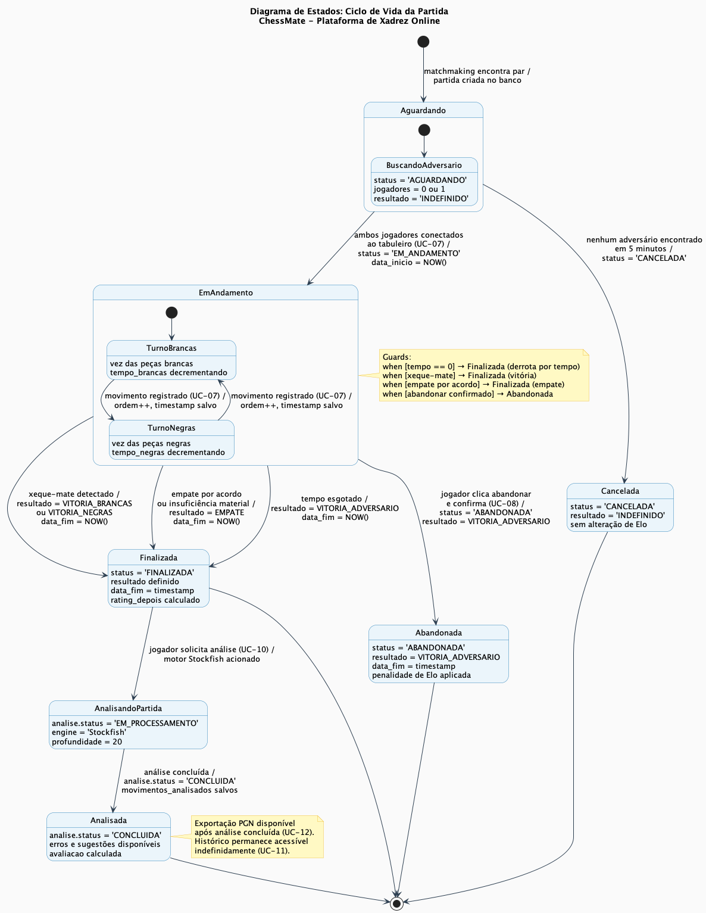 |
| **Estado — Ciclo de Vida da Conta** | **Arquitetura C4 Container** |
| 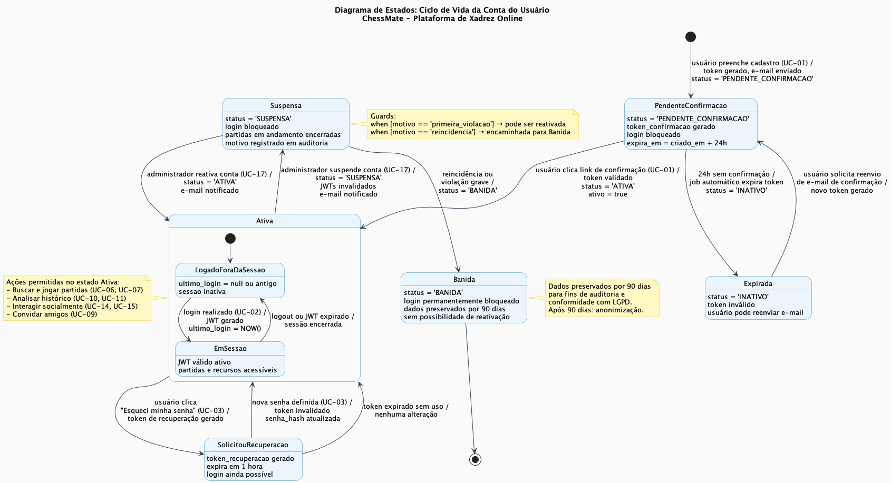 |  |

### 🌐 Aplicação Web

Para melhor visualização, as telas principais do sistema estão representadas pelos diagramas de sequência e DSS que documentam cada fluxo de interação.

| Fluxo | Diagrama de Sequência | DSS (Visão de Sistema) |
| :---: | :---: | :---: |
| **Login** | 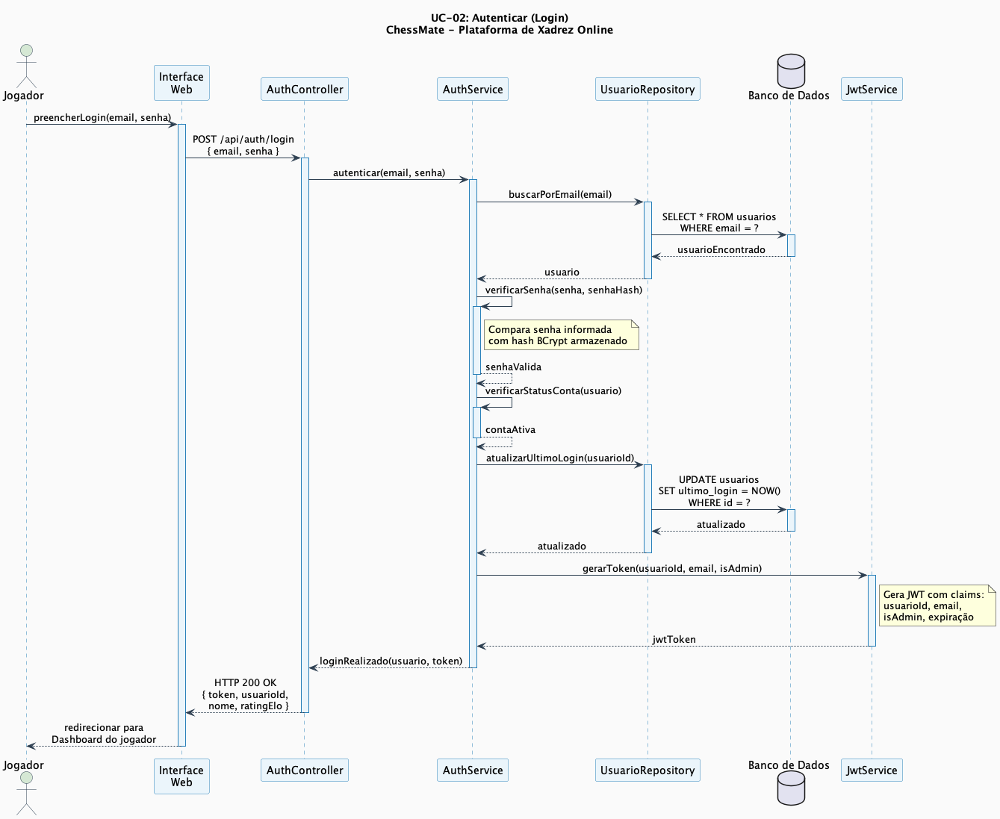 | 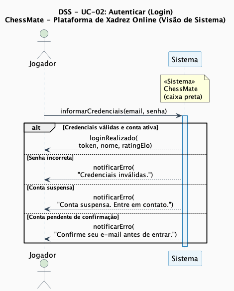 |
| **Buscar Partida** |  | 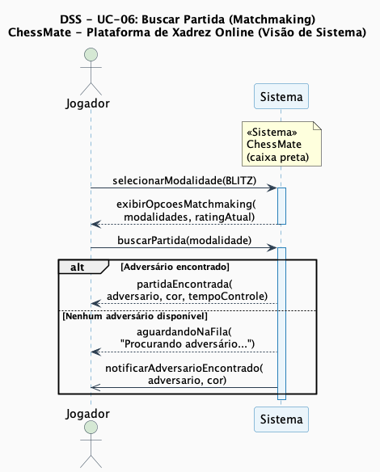 |
| **Jogar Partida** | 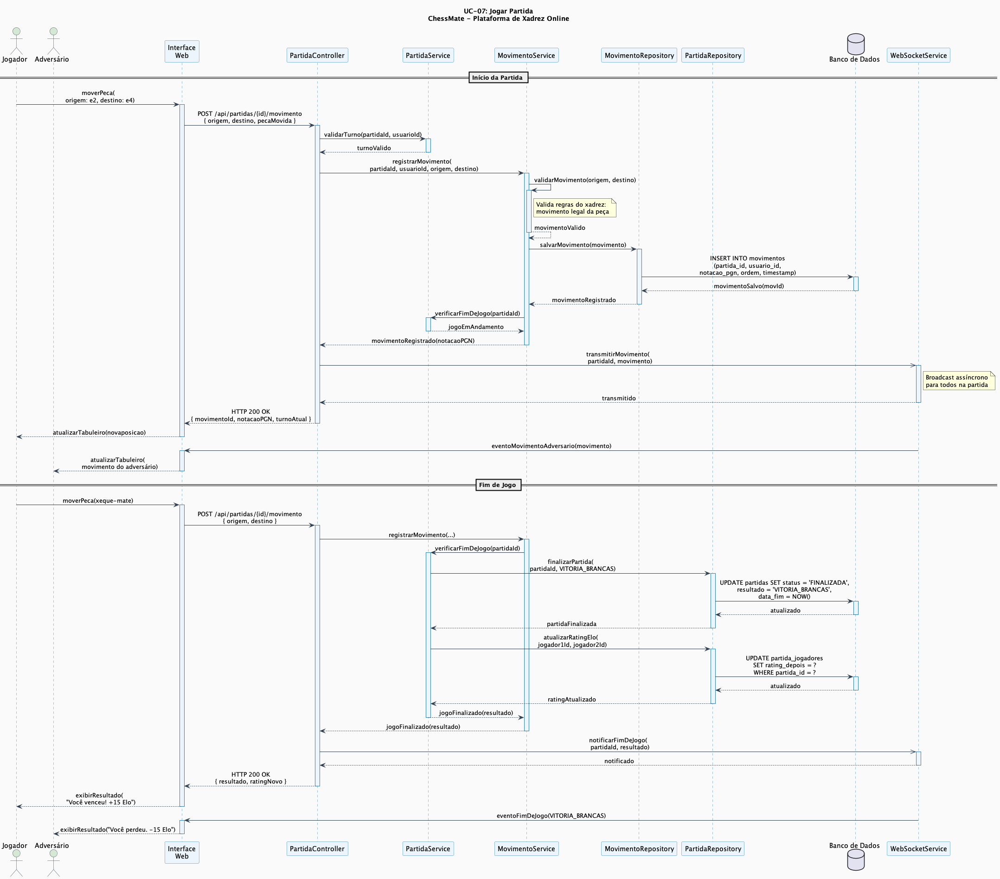 | 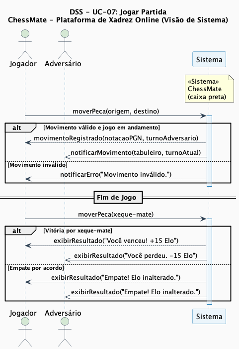 |
| **Analisar Partida** | 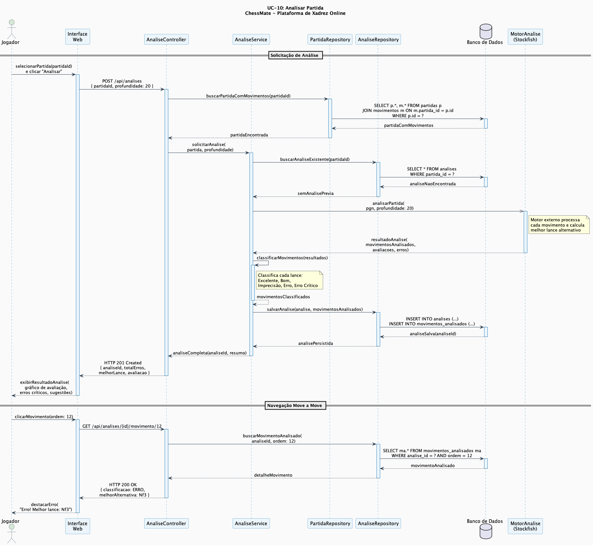 | 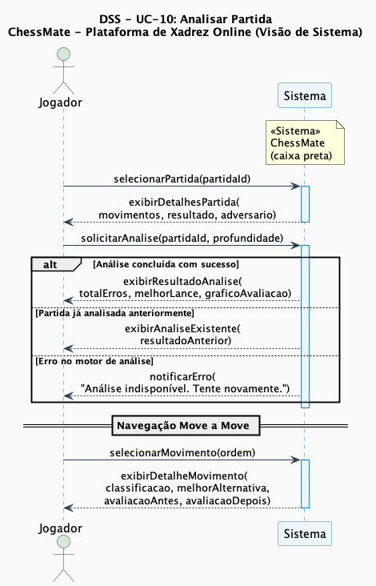 |

### 💻 Exemplo de Saída no Terminal (para Back-end, API, CLI)

#### 1. Buscar partida via API REST

```bash
curl -X POST 'http://localhost:8080/api/partidas/buscar' \
     -H 'Authorization: Bearer <jwt-token>' \
     -H 'Content-Type: application/json' \
     -d '{"modalidade": "BLITZ", "ratingElo": 1450}'
```

**Saída Esperada:**
```json
{
  "partidaId": "a1b2c3d4-e5f6-7890-abcd-ef1234567890",
  "status": "EM_ANDAMENTO",
  "brancas": { "id": 1, "nome": "vitorazevedo", "ratingElo": 1450 },
  "negras":  { "id": 42, "nome": "adversario_x", "ratingElo": 1420 },
  "modalidade": "BLITZ",
  "tempoControle": 300,
  "dataInicio": "2026-06-13T21:00:00Z"
}
```

---

#### 2. Registrar um movimento via WebSocket (STOMP)

```bash
# Destino STOMP: /app/partidas/{id}/movimento
{
  "origem": "e2",
  "destino": "e4",
  "pecaMovida": "PEAO"
}
```

**Broadcast no tópico `/topic/partidas/{id}`:**
```json
{
  "tipo": "MOVIMENTO",
  "movimento": { "origem": "e2", "destino": "e4", "notacaoPGN": "e4" },
  "fen": "rnbqkbnr/pppppppp/8/8/4P3/8/PPPP1PPP/RNBQKBNR b KQkq e3 0 1",
  "avaliacao": "+0.2",
  "proximoTurno": "NEGRAS"
}
```

---

## 🧪 Testes

### Testes Unitários e de Integração (Back-end)

```bash
cd backend
./mvnw test
```
*Ferramenta utilizada: JUnit 5 + Mockito + Spring Boot Test*

### Testes de Componentes (Front-end)

```bash
cd frontend
npm run test
```
*Ferramenta utilizada: Vitest + React Testing Library*

### Testes End-to-End (E2E)

```bash
cd frontend
npm run test:e2e
```
*Ferramenta utilizada: Playwright*

---

## 🔗 Documentações utilizadas

* 📖 **Framework (Back-end):** [Documentação Oficial do Spring Boot](https://docs.spring.io/spring-boot/docs/current/reference/html/)
* 📖 **WebSocket:** [Spring WebSocket Reference](https://docs.spring.io/spring-framework/reference/web/websocket.html)
* 📖 **Framework (Front-end):** [Documentação Oficial do React](https://react.dev/reference/react)
* 📖 **Build Tool:** [Guia de Configuração do Vite](https://vitejs.dev/config/)
* 📖 **Banco de Dados:** [Documentação do PostgreSQL 15](https://www.postgresql.org/docs/15/)
* 📖 **Cache:** [Documentação do Redis 7](https://redis.io/docs/)
* 📖 **Containerização:** [Documentação de Referência do Docker](https://docs.docker.com/)
* 📖 **Segurança:** [Spring Security Reference](https://docs.spring.io/spring-security/reference/)
* 📖 **Migração:** [Documentação do Flyway](https://documentation.red-gate.com/flyway)
* 📖 **Diagramas:** [PlantUML Language Reference](https://plantuml.com/sitemap-language-specification)
* 📖 **Padrão de Commits:** [Conventional Commits](https://www.conventionalcommits.org/en/v1.0.0/)
* 📐 **Índice de Diagramas:** [diagramas/diagramas.md](./diagramas/diagramas.md)

---

## 👥 Autores

| 👤 Nome | 🖼️ Foto | :octocat: GitHub | 💼 LinkedIn | 📤 Gmail |
|---------|----------|-----------------|-------------|-----------|
| Vitor Azevedo | <div align="center"></div> | <div align="center"><a href="https://github.com/vitorazevedop7"></a></div> | <div align="center"><a href="https://www.linkedin.com/in/vitorazevedop7"></a></div> | <div align="center"><a href="mailto:vitorazevedop7@gmail.com"></a></div> |

> [!TIP]
> 💡 **Dica:** Escolha uma foto profissional, preferencialmente de rosto, evitando imagens com baixa qualidade, filtros excessivos ou elementos distrativos.

---

## 🤝 Contribuição

1. Faça um `fork` do projeto.
2. Crie uma branch para sua feature (`git checkout -b feature/minha-feature`).
3. Commit suas mudanças (`git commit -m 'feat: Adiciona nova funcionalidade X'`). **(Utilize [Conventional Commits](https://www.conventionalcommits.org/en/v1.0.0/))**
4. Faça o `push` para a branch (`git push origin feature/minha-feature`).
5. Abra um **Pull Request (PR)**.

> [!IMPORTANT]
> 📝 **Regras:** Por favor, verifique o arquivo [`CONTRIBUTING.md`](./CONTRIBUTING.md) para detalhes sobre nosso guia de estilo de código e o processo de submissão de PRs.

---

## 🙏 Agradecimentos

Gostaria de agradecer aos seguintes canais e pessoas que foram fundamentais para o desenvolvimento deste projeto:

* [**Engenharia de Software PUC Minas**](https://www.instagram.com/engsoftwarepucminas/) — Pelo apoio institucional, estrutura acadêmica e fomento à inovação e boas práticas de engenharia.
* [**Prof. Dr. João Paulo Aramuni**](https://github.com/joaopauloaramuni) — Pelos valiosos ensinamentos em **Projeto de Software**, **Arquitetura de Software** e **Padrões de Projeto**.
* [**PlantUML**](https://plantuml.com/) — Pela ferramenta de diagramação open-source que viabilizou toda a modelagem UML do projeto.

---

## 📄 Licença

Este projeto é distribuído sob a **[Licença MIT](./LICENSE)**.
